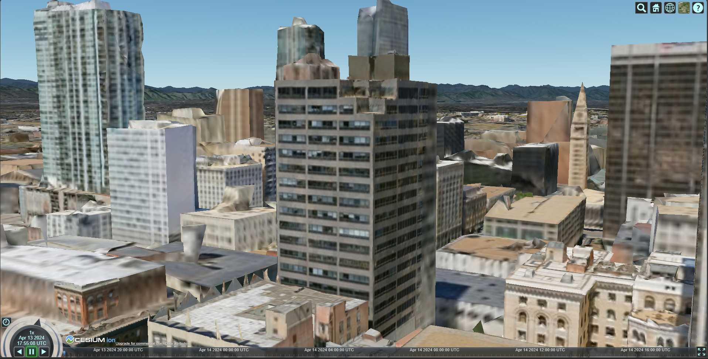

# Cesium Project

## Run the application

Run the following in the parent folder 

`npm install`

`npm start`

Then open `localhost:8080`

## 3rd Party Data to process

[Open Heritage 3d Apollo 1 Pad](https://openheritage3d.org/project.php?id=kz88-9d21)

Wanted to use the higher res data but couldn't process e57 files.

## Pictures of progress

